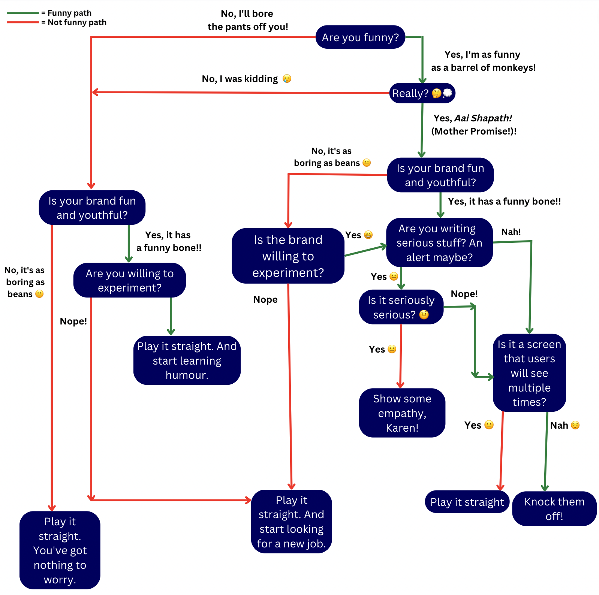

So, my manager moved me from copywriting to UX writing because I am not funny enough to write copy.

It’s true. On Children’s Day this year, we were told to bring something to work, something that would remind us of our childhood. When I didn’t bring anything, someone said I was so old that I didn’t remember my childhood.

I am so serious and boring and not at all funny except when I am talking to my girl. She giggles a lot when I talk to her but that’s probably because she thinks she is obligated to. Or maybe I still act dumb when I am with her.

Anyway, I think UX writing needs one to be funny too, especially when the brand is fun and youthful.

UX writing is like giving a voice to the experience and interface. It facilitates conversations between the user and the platform/product. Good conversations happen when the people involved are not only knowledgeable but also funny and empathetic. So, it’s good if your UX microcopy can elicit a certain kind of laughter. Not like your-chai-coming-out-of-your-nose laugh but also not a half-hearted chuckle, if you know what I mean. Also, not always. Sometimes, they need to be empathetic too. You can’t afford to be funny when your users are in the middle of something super important on your platform and suddenly, the platform stops working.

Anyway, I decided I have to find the right balance between humour and empathy. And more importantly, I decided to be this particular kind of funny.

But how?

I refused to believe that humour is an innate ability, that you can either do it, or you can’t. Ok, maybe I don’t have it in me to become a standup comedian, maybe I will act like a comma at the end of a sentence if you put me in the middle of a fun conversation and ask me to participate. But I can definitely bring in humour in my writings. After all, I have an IQ of 131. I should be able to come up with a framework! I thought.

Anyway, I started reading a lot on how to be funny even if you are not.

One of the articles I read said do something wrong once in your life. Chances are 8 years later, it will be a super funny story.

It’s true, I am super serious. I take measured steps. I hate not planning ahead, not being mentally prepared. I understand we shouldn’t be like that but then again even if I start making mistakes now, I don’t have 8 years for the story to become funny. What if I lose my job tomorrow? That’s a more ridiculous tip compared to my ambitious ‘how to be funny’ framework.

Another article said get feedback from living beings, you know, in the context of their reactions to your jokes and how you can improve. Like seriously? I hadn’t considered that the recipients of my attempted humour need to be alive and breathing!

I almost decided to give up. Probably, humour is indeed an innate ability. Not everything can be theorised and put in the form of a framework. The C-3PO in me was probably lucky when I tried this approach with love and romance.

I began writing a long message to my manager about my failed attempt at humour, part of which has been used in this article.

Just when I was about to send it to him, I saw a flow chart in my mind on when to use humour and when empathy in your UX microcopy, and when to start looking for a new job.

Although this is based on a flow chart created by Ryan Farrell, maker of Daily UX Writing, I have made some major changes to it.

Hummm. Not bad. I guess I do have a sense of humour. Maybe Schrodinger’s humour, if you know what I mean.
